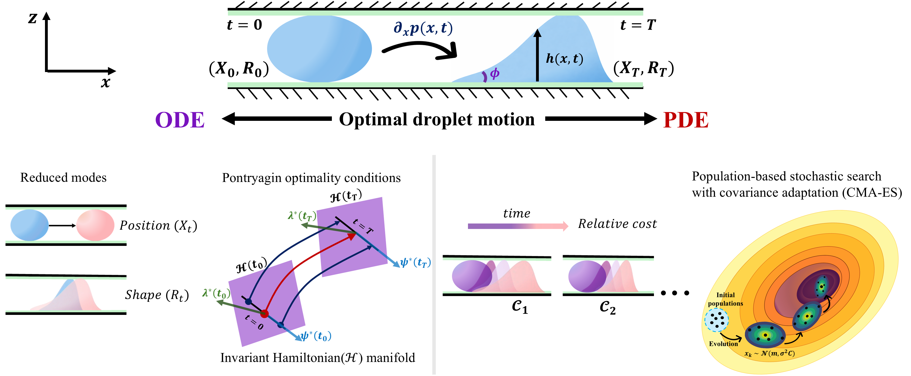
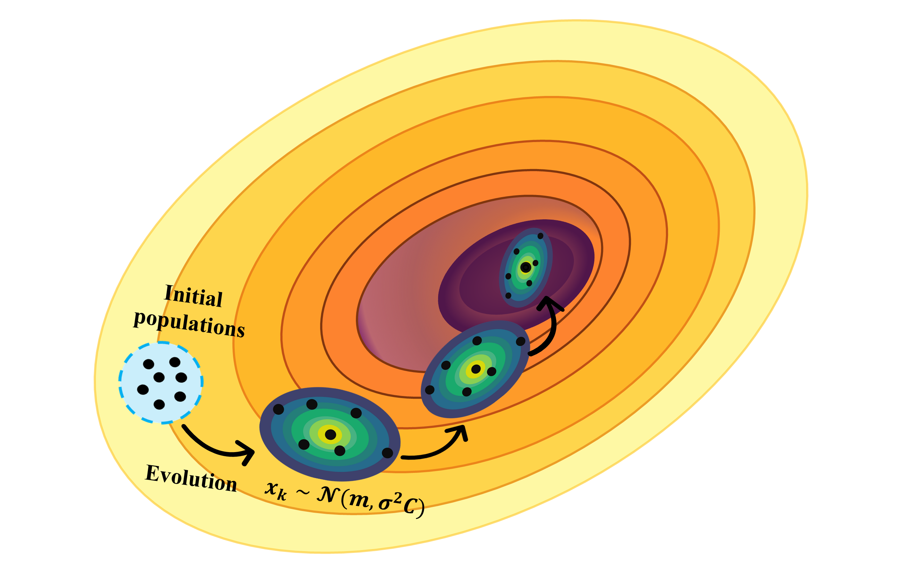

# Optimal Droplet Transport in a Microchannel

**An optimal control framework for efficient fluid transport**

This repository contains a computational framework for designing energy-efficient strategies to transport fluid droplets in confined geometries (see Fig. 1). By integrating **Optimal Control Theory** with **Lubrication Theory**, we address the inverse problem of fluid dynamics: rather than simply observing how a droplet moves, we calculate the precise time-dependent control signals required to transport it to a specific target.

<p>
  <br>
  
  <br>
  <em>
    <strong>Fig. 1: Optimal droplet tranport. </strong>
    The diagram illustrates the optimal motion of a droplet as it moves from its initial position and size to a desired target state. The system follows a control protocol specifically designed to minimize viscous dissipation while transporting the droplet through the microchannel.
  </em>
</p>

### Objectives
* **Precision Control:** Drive a passive droplet to a desired position and size with varying surface tension.
* **Energy Efficiency:** Minimize viscous dissipation throughout the transport process.
* **Regime Discovery:** Parametrize target distances and capillary numbers to identify optimal transport mechanisms in microfluidic systems.


### Optimal Control Strategy

To solve the optimal transport problem, we employ a two-complementary approach that balances computational efficiency with physical fidelity.

### 1. Reduced Order Optimal Control (ODE)
We first approximate the system by projecting the continuum model onto low-order modes governing the droplet's **position** and **width**.
* **Method:** This yields a low-dimensional system of Ordinary Differential Equations (ODEs) that captures the essential balance between deformation and translation.
* **Solver:** We apply **Pontryagin's Maximum Principle** to these compact equations to determine control policies analytically and numerically.
* **Benefit:** This approach provides fast, interpretable insights and reveals distinct transport strategies (such as the TR and CTR modes).


### 2. PDE Optimal Control (Full Nonlinear Model)
To validate the reduced model, we solve the transport problem directly using the full nonlinear thin-film PDE for height $h(x, t)$.
* **Challenge:** The problem constitutes a transient boundary-value problem (fixed initial and final states), making standard adjoint-based gradient methods difficult to implement.
* **Solver:** We utilize the **Covariance Matrix Adaptation Evolution Strategy (CMA-ES)**, a gradient-free evolutionary optimizer.
* **Workflow:** CMA-ES iteratively samples candidate control profiles $G(x, t)$, integrates the PDE forward in time, and updates the search distribution based on the cost function.
* **Benefit:** This allows us to find global optima in a rugged landscape without requiring complex derivative calculations.


--------------------------------------
--------------------------------------

## 1. Reduced Order Optimal Control (ODE)

We have shown the detailed analytical solution of ODE and derivation of dynamics in the paper. Please go through the paper for calculations.
We solved the dynamics and got the optimal control profile.
The reduced-order model yields an analytical relationship relating the target displacement $X_T$ and target radius $R_T$ to the control parameter $s$:

$$
\frac{X_T}{R_0} = \sqrt{\frac{33 s^2}{250 \sinh^2(s)} \left[  \left(\frac{R_T}{R_0}\right) \left( 2 \cosh(s) - \frac{R_T}{R_0} \right) - 1 \right]}
$$

Where:
* $X_T$: Target center of mass.
* $R_0$: Initial droplet radius.
* $R_T$: Target droplet radius.
* $s$: A simplified control parameter derived from the reduced dynamics. 
 
We have provided the full Python source code for the reduced-order optimization in the `ODE_OPTIMAL_CONTROL` folder. This includes scripts to compute both the state variables and the optimal control profiles. Users can run these scripts directly to reproduce the analytical results and generate the profile plots.

* **NumPy** (for numerical operations)
* **Matplotlib** (for plotting and visualization)
* **SciPy** (specifically `optimize` and `integrate` modules)

**Installation Command:**
```pip install numpy matplotlib scipy```

### Accessing the ODE Solutions:
> **Required Libraries:**
> ```python
> import numpy as np
> import matplotlib.pyplot as plt
> from scipy.optimize import root_scalar
> from scipy.integrate import cumulative_trapezoid
> ```


--------------------------------------------------------
--------------------------------------------------------

## 2. Full non-linear Optimal Control (PDE)

Full PDE model implements a computational framework for the optimal control of fluid droplets in confined geometries. By solving the thin-film lubrication PDE forward in time and optimizing the time-dependent forcing, we generate control strategies that drive a droplet to a desired final state with minimal energy cost.
The approach combines high-fidelity Finite-Element Simulation (FEM) with a robust evolutionary algorithm in a fully automated pipeline.

### **Documentation Roadmap**
PDE documentation is organized into three distinct parts to guide you through the theory, implementation, and execution of the code.

**Part I: The Forward Solver (FEM/FEniCS)** We detail the numerical implementation of the thin-film PDE using FEniCS. This section explains how the governing equations are discretized in space and advanced in time to simulate the droplet's evolution under applied forcing.

**Part II: The Optimizer (CMA-ES)** We discuss the integration of the Covariance Matrix Adaptation Evolution Strategy (CMA-ES). This section covers how the optimizer acts as a "wrapper" around the PDE solver, iteratively adjusting control parameters to minimize the cost function without requiring gradient calculations.

**Part III: Execution Guide** We provide a brief guide on how to configure and run the code. This includes setting target parameters in params.txt, submitting jobs to an HPC cluster, and visualizing the optimal control profiles and state variables.

## Part I. Numerical Methods for Partial Differential Equations (PDEs)

### 1. Mass Conservation (Weak Form derivation) 

The starting point is the **strong form** of the continuity equation:

$$\frac{\partial h}{\partial t} + \frac{\partial q}{\partial x} = 0$$

#### Step 1: Weighted Residual Method
Multiply by a **test function** $v(x)$ and integrate over the domain $\Omega$:

$$\int_{\Omega} \frac{\partial h}{\partial t} v \ dx + \int_{\Omega} \frac{\partial q}{\partial x} v \ dx = 0$$

#### Step 2: Integration by Parts
To reduce the continuity requirement on $q$, we shift the derivative to the test function $v$:

$$\int_{\Omega} \frac{\partial h}{\partial t} v \ dx - \int_{\Omega} q \frac{\partial v}{\partial x} \ dx + \left[ qv \right]_{\partial\Omega} = 0$$

> **Boundary Condition:** Assuming no flux on the boundary ($q=0$), the term $[qv]_{\partial\Omega}$ vanishes.

#### Step 3: Temporal Discretization
Using a finite difference approximation for the time derivative:
$$\frac{\partial h}{\partial t} \approx \frac{h^{n+1} - h^n}{\Delta t}$$

Substituting this into the weak form:
$$\int_{\Omega} \left( \frac{h^{n+1} - h^n}{\Delta t} \right) v \ dx - \int_{\Omega} q^\theta v_x \ dx = 0$$

* **Trial Function:** $h$ (The unknown for the new time step).
* **Test Function:** $v$.


### 2. Auxiliary Equation (Second-Order Terms)

To handle second-order derivatives like $h_{xx}$, we define an auxiliary variable $d2h$:

**Strong Form:**
$$d2h - \frac{\partial^2 h}{\partial x^2} = 0$$

#### Weak Form derivation
1. **Weighted Integral:**

   Multiply by a **test function** $u(x)$ and integrate over the domain $\Omega$:
   $$\int_{\Omega} (d2h)u \ dx - \int_{\Omega} h_{xx} u \ dx = 0$$

2. **Integration by Parts:**
   $$\int_{\Omega} (d2h)u \ dx + \int_{\Omega} h_x u_x \ dx - [h_x u]_{\partial\Omega} = 0$$

3. **Final Auxiliary Weak Form:**
   $$\int_{\Omega} h_x u_x \ dx + \int_{\Omega} (d2h)u \ dx = 0$$

* **Trial Function:** $d2h$.
* **Test Function:** $u$.

Our system is defined by two primary equations. We treat them as **residuals**—essentially, we want the numerical solver to drive these values to zero.
The two equations we solve are
1.  **Mass Conservation:** $$\int_{\Omega} \frac{h - h_n}{\Delta t} v \ dx - \int_{\Omega} q(\cdot) v_x \ dx = 0$$
2.  **Auxiliary Equation (The link to second-order derivatives):**
    $$\int_{\Omega} h_x u_x \ dx + \int_{\Omega} (d2h) u \ dx = 0 \quad \iff \quad d2h = h_{xx}$$


### 3. Why is the Weak Form important?

The Weak Form is the backbone of modern numerical solvers like **FEniCS**. Here is why we use it instead of the Strong Form. We have listed some reasons in support of weak form 

1.  **Existence of Solutions:** A "Weak Solution" can exist even when a "Strong Solution" doesn't. Strong forms require pointwise derivatives (e.g., $h_{xx}$), which are hard to solve for sharp gradients.
    * Weak form only requires derivatives in the **integrated sense**.
    * We avoid requiring $h \in C^2$; instead, $h \in H^1(\Omega)$ is sufficient for terms like $h_x u_x$.
2.  **Natural Boundary Conditions:** Integration by parts naturally surfaces boundary flux terms, making it simpler to implement BCs.
3.  **FEniCS Compatibility:** FEniCS does **not** solve the strong form. Standard Lagrange spaces in FEniCS are $C^0$, whereas a 4th-order PDE in strong form would require $C^1$ elements.


**Understanding $C^0$ and $C^1$ Continuity**
In a 1D Mesh, the continuity of our elements defines what math we can perform:

| Continuity | Description | Visual Logic |
| :--- | :--- | :--- |
| **$C^0$** | Function $u(x)$ is continuous, but its derivative $u_x$ may be discontinuous. | Value matches at boundaries, but slopes do not. |
| **$C^1$** | Both $u(x)$ and its derivative $u_x$ are continuous. | Both values and slopes match at boundaries. |

> **Key Takeaway:** By using the Weak Form, we can solve complex PDEs using simpler $C^0$ elements because we've reduced the "smoothness" requirement of the solution.


Our system is defined by two primary equations. We treat them as **residuals**—essentially, we want the numerical solver to drive these values to zero.

* **Mixed Unknowns (Trial Functions):** $(h, d2h)$
* **Test Functions:** $(v, u)$

 


### 4. Time Discretization: How things change over time

To solve these on a computer, we have to "chunk" time into steps ($t, t+1$).

**Backward Euler (BDF1):**
For the time derivative $h_t$, we usually use a Backward Euler approach:
$$h_t(t^{n+1}) \approx \frac{h^{n+1} - h^n}{\Delta t}$$
> **Note:** Even if we use more complex schemes for other parts of the equation, the time-derivative itself is almost always treated as BDF1 for stability.

### 5. The Crank-Nicolson ($\theta$-scheme)
When we want more accuracy, we use the **Crank-Nicolson** method (setting $\theta = 0.5$). This is a **semi-implicit** scheme that evaluates the terms at the midpoint of the time step.
We define our variables at the midpoint as:
* **Midpoint Height:** $h^\theta = \frac{h^n}{2} + \frac{h^{n+1}}{2}$
* **Midpoint Curvature:** $(d2h)^\theta = \frac{(d2h)^n}{2} + \frac{(d2h)^{n+1}}{2}$

While calculating flux terms (like stress $S$), we evaluate them at this $\theta$ midpoint to keep the physics balanced:
$$S^\theta = h^\theta (\text{geometry term}) + \gamma(d2h)^\theta$$
* The first part involves the $x$-derivative of the height.
* The second part uses the Crank-Nicolson evaluation of our auxiliary variable.


### 6. Handling non-linearities: Adams-Bashforth (AB2)

When our equations include non-linear terms like mobility $m(h)$ or disjoining pressure $\Pi(h)$, solving them purely implicitly can be a nightmare. To keep things efficient, we use **Adams-Bashforth 2nd Order (AB2)**.
AB2 is an **explicit 2-step extrapolation**. Instead of guessing the future, we look at the current ($n$) and previous ($n-1$) time steps to predict a value for the next step ($n+1$):

$$h^{\star, n+1} = \frac{3h^n}{2} - \frac{h^{n-1}}{2}$$

We use this "predicted" $h^\star$ to evaluate the messy, non-linear coefficients at the new time step without needing a complex non-linear solver for every single term.


### 7. The strategy: Combining AB2 and Crank-Nicolson

In a complex flux equation $q(h^\star, h^\theta, (d2h)^\theta, G_0, G_1)$, we split the job in two subsections

1.  **Non-Linear Terms (AB2):** Use $h^\star$ for
    * Mobility: $m(h^\star)$
    * Disjoining Pressure: $\Pi'(h^\star)$
2.  **Stiff/Linear Terms (Crank-Nicolson):** Use $h^\theta$ and $(d2h)^\theta$ for:
    * Surface Tension/Curvature: Derivatives like $S_x$ and $h_x$.

The Final Flux Calculation ($q^{n+1}$) - 
By combining above steps, we get a stable flux term for our next step:
$$q^{n+1} = m(h^\star) \left( \partial_x \left[ h^\theta (G_0 + G_1 x) + \gamma (d2h)^\theta \right] - \Pi_1'(h^\star) \partial_x h^\theta \right)$$


After all the derivations, these are the two equations we actually solve using FEniCs. We write them in Residual Form ($F = 0$).

$$\int_{\Omega} \frac{h^{n+1} - h^n}{\Delta t} v \ dx - \int_{\Omega} q^{n+1} v_x \ dx = 0$$

$$\int_{\Omega} h_x^{n+1} u_x \ dx + \int_{\Omega} (d2h)^{n+1} u \ dx = 0$$


This repository documents the derivation and numerical implementation of Partial Differential Equations (PDEs) for thin-film dynamics. We transform complex "Strong Form" equations into a "Weak Form" suitable for Finite Element solvers like FEniCS.
Thin-film equations are extremely "stiff" and non-linear (e.g., mobility $m(h) \approx h^3$). We use a "Hybrid Scheme" to balance stability and speed.

The $\theta$-Scheme (Crank-Nicolson): 
For **stiff linear terms** (like surface tension), we use $\theta = 0.5$. This evaluates the term at the midpoint of the time step:
* $h^\theta = \theta h^{n+1} + (1-\theta) h^n$
* $(d2h)^\theta = \theta (d2h)^{n+1} + (1-\theta) (d2h)^n$

Adams-Bashforth (AB2) for non-linearities:
For non-linear terms like mobility $m(h^\ast)$ and disjoining pressure $\Pi(h^\ast)$, we use an explicit 2-step extrapolation ($h^\star$) so we don't have to solve non-linear system at every step:
$$h^\star = \frac{3}{2}h^n - \frac{1}{2}h^{n-1}$$

By combining these, our flux $q^{n+1}$ is evaluated using "known" history for the nonlinear parts and "unknown" future variables for the stiff parts:

$$q^{n+1} = m(h^\star) \left( \partial_x \left[ h^\theta (G_0 + G_1 x) + \gamma (d2h)^\theta \right] - \Pi_1'(h^\star) \partial_x h^\theta \right)$$


We need to derive the exact form of the flux $q^{n+1}$ to separate the "Knowns" from the "Unknowns".

#### **The flux equation:**
$$q^{n+1} = m(h^\ast) \left( (S^\theta)_x - \Pi_1(h^\ast) (h^\theta)_x \right)$$


#### Step 1: Expand the Stress Derivative $(S^\theta)_x$
Since $S^\theta = h^\theta(G_0 + G_1 x) + \gamma (d2h)^\theta$, the derivative is:
$$(S^\theta)_x = (G_0 + G_1 x)(h^\theta)_x + G_1 h^\theta + \gamma (d2h)^\theta_x$$

#### Step 2: Separate known vs. unknown terms
We substitute $h^\theta = \theta h^n + (1-\theta) h^{n+1}$.

The unknown terms (terms with $n+1$) are multiplied by $(1-\theta)$:
$$\text{Term}_2 = (1-\theta) \left[ (G_0 + G_1 x)(h^{n+1})_x + G_1 h^{n+1} + \gamma (d2h)^{n+1}_x \right]$$

The known terms (terms with $n$) are multiplied by $\theta$ (from the CN definition) and form $q_{\text{known}}$.

#### Step 3: The final flux assembly
We multiply by the mobility $m(h^{*})$ and subtract the disjoining pressure term.

$$
q^{n+1} = \underbrace{q_{\text{known}}(h^n, \partial_{xx}h^n)}_{\text{Known (goes to RHS)}} + \underbrace{(1-\theta) m(h^*) \left[ \underbrace{(G_0 + G_1 x)\partial_x h^{n+1} + G_1 h^{n+1}}_{\text{Control Stress}} + \gamma \partial_x (\partial_{xx} h^{n+1}) - \Pi'(h^*) \partial_x h^{n+1} \right]}_{\text{Unknown (Linear in } h^{n+1}, \text{goes to LHS})}
$$


In FEniCS, we do not manually build the matrix. We define the **Residual** and let FEniCS split it.

#### The Residual Structure
$$\text{Res}(h^{n+1}, (d2h)^{n+1}; v, u) = a((h^{n+1}, (d2h)^{n+1}), (v, u) ) - L((v, u)) = 0$$
Let  $\omega:= (h^{n+1}, (d2h)^{n+1})$ and $\psi:=(v, u)$

1.  **$a(\omega, \psi)$ - Bilinear Form:**
    * Linear in unknowns ($h^{n+1}$) and test Functions ($v, u$).
    * This generates the Matrix A (LHS).
    * *Includes* $(1-\theta)$ parts of the flux expansion.

2.  **$L(\psi)$ - Linear Form:**
    * It is linear in Test Functions only. It contains only known data.
    * This generates the Vector b (RHS).
    * *Includes* The $q_{\text{known}}$ parts.

Hence, $Res(\omega; \psi) = 0 \quad \forall \psi$ $\Rightarrow$ $a(\omega, \psi) = L(\psi) \quad \forall \psi $


In FEniCS, we solve $a(\omega, \psi) = L(\psi)$. We must go through our Weak Form term by term and decide: **Does this belong to $a$ (Unknowns) or $L$ (Knowns)?**

#### Term 1: The Time Derivative $\int \frac{h - h^n}{\Delta t} v \, dx$
We split this fraction into two integrals:
1.  $\int \frac{1}{\Delta t} h^{n+1} v \ dx \quad \rightarrow \quad \in \mathbf{a(\omega, \psi)}$ (Unknown)
2.  $- \int \frac{1}{\Delta t} h^n v \ dx \quad \rightarrow \quad \in \mathbf{L(\psi)}$ (Known)

#### Term 2: The Flux Integral $-\int q v_x \ dx$
1.  $-\int q_{\text{known}} v_x \ dx \quad \rightarrow \quad \in \mathbf{L_{\text{flux}}(\psi)}$
2.  $-(1-\theta) \int m(h^*) \left[ \dots \text{complex terms} \dots \right] v_x \ dx \quad \rightarrow \quad \in \mathbf{a_{\text{flux}}(\omega, \psi)}$

#### Terms 3 & 4: The Auxiliary Equation $\int h_x u_x \ dx + \int (d2h) u \ dx = 0$.

* $h$ and $d2h$ are both unknowns (Trial Functions) at step $n+1$, these terms are purely Bilinear.
* Both belong to $\mathbf{a(\omega, \psi)}$.

We define the Total Residual as:
$\text{Res} = \text{Term}_1 + \text{Term}_2 + \text{Term}_3 + \text{Term}_4$

We separated the terms linearly, FEniCS can automatically extract the matrix and vector:

```python
# The "Magic" Command
a = lhs(Res)  # Extracts all terms with h^(n+1) or (d2h)^(n+1)
L = rhs(Res)  # Extracts all terms with h^n or (d2h)^n

# Solve
solve(a == L, w)
```

Now we explain how to translate the weak forms into FEniCS code by splitting the equations into Bilinear ($a$) and Linear ($L$) forms, and how to set up the correct **Function Spaces**.
In Finite Element code, we don't just write "Equation = 0". We must separate the terms based on whether they contain the Unknowns ($h^{n+1}, (d2h)^{n+1}$) or only known data ($h^n$).
The Solver solves: $a(\omega, \psi) = L(\psi)$


### 8. From Math to Matrix: Discretization

Computers cannot solve continuous functions $h(x)$. They solve for coefficients at specific points (nodes).

**Basis Functions**: We approximate our unknown functions as a sum of simple Basis Functions $\phi_j(x)$ (usually little tents or pyramids):
$$h(x) \approx \sum_{j=1}^{N} H_j \phi_j(x)$$
* $H_j$: The unknown coefficient (value at node $j$).
* $\phi_j$: The shape function known by FEniCS.

While substituting this sum into our integral equations, we get a linear matrix system.
When we discretize the problem using Finite Elements, we approximate the infinite-dimensional functions $h(x)$ and $d2h(x)$ as sums of basis functions $\phi_j(x)$:
$$h(x) \approx \sum_{j=1}^{N} H_j \phi_j(x) \quad \text{and} \quad d2h(x) \approx \sum_{j=1}^{N} D_j \phi_j(x)$$

This transforms our integral equations into a global **Linear Algebra System** $Ax=b$.
We solve for the combined vector of coefficients $\mathbf{x} = [H, D]^T$. The system converts into a matrix structure:

$$ {\left\lbrack \matrix{{A}_{hh} & {A}_{h,d2h}\cr {A}_{d2h,h} & {A}_{d2h,d2h}} \right\rbrack} 
 \left\lbrack \matrix{H  \cr D} \right\rbrack
= \left\lbrack \matrix{{b}_h \cr {b}_{d2h}} \right\rbrack
$$

| Matrix block | Corresponding integral term | Physical significance |
| :--- | :--- | :--- |
| **$\mathbf{A}_{hh}$** | $\int \frac{1}{\Delta t} h v \ dx - \int q(h) v_x \ dx  \quad \quad \quad $ | Mass & Transport: Contains the time derivative and flux terms involving height $h$ (Gravity). |
| **$\mathbf{A}_{h,d2h}$** | $-\int \gamma (d2h)_x v_x \ dx$ | Capillarity: The flux term driven by the gradient of curvature (Surface Tension). |
| **$\mathbf{A}_{d2h,h}$** | $\int h_x u_x \ dx$ | Geometry: The weak form of the second derivative definition ($d2h = h_{xx}$). |
| **$\mathbf{A}_{d2h,d2h}$** | $\int (d2h) u \ dx$ | Mass Matrix (Auxiliary): The identity-like term connecting the auxiliary variable to itself. |

| Vector | Corresponding integral term | Physical significance |
| :--- | :--- | :--- |
| **$\mathbf{b}_h$** | $\int \frac{h^n}{\Delta t} v \ dx - \int q_{\text{known}} v_x \ dx$ | History: The state of the film from the previous time step. |
| **$\mathbf{b}_{d2h}$** | $0$ | Usually zero (unless specific boundary conditions apply). |


### 9. Time stepping strategy: Explicit vs. Implicit

To solve the system efficiently, we must choose how to handle time evolution. Here, we use a **semi-implicit** approach to balance stability and computational cost.

#### Comparison of methods

| Method | Definition | Pros/Cons |
| :--- | :--- | :--- |
| **Explicit (AB2)** | Uses only "known" quantities from old time steps ($n, n-1$). | **Fast** per step, but **Unstable** for large time steps. |
| **Implicit (CN)** | Involves "unknown" quantities at the new time step ($n+1$). | **Stable**, but requires solving a system of equations. |
| **Semi-Implicit** | **We adapted:** Treats linear/stiff (linear) terms implicitly and nonlinear coefficients ($h^*$) explicitly. | **Best compromise:** Avoids solving nonlinear systems every step while maintaining stability. |

Some may argue that why can't we solve it fully implicitly, if we treat everything implicitly including coefficients $m(h)$ and $\Pi(h)$ we would have to solve a Nonlinear System at every single time step and is is computationally **expensive** and complex.
We use an implicit method primarily because the surface tension (capillarity) term is mathematically "stiff," meaning it requires very small ($10^{-8}$) time steps if solved explicitly. Let's understand it why we need implicit scheme

Let's ignore the disjoining force for a moment and keep only capillarity. The equation simplifies to:
$$h_t + \partial_x \left( h^3 \partial_x (\gamma \partial_{xx} h) \right) = 0$$

Linearizing around a uniform film $h \approx h_0 + \epsilon \hat{h}$ (where $h_0$ is constant and $\epsilon$ is perturbation coefficient):
$$\hat{h}_t + \gamma h_0^3 \hat{h}_{xxxx} = 0$$

If we take a Fourier mode $\hat{h} \sim e^{ikx}$, the spatial derivative becomes $\partial_x \to ik$. The fourth derivative becomes $k^4$:
$$\frac{\partial \hat{h}}{\partial t} = -\gamma h_0^3 k^4 \hat{h}$$

This shows that high wavenumbers (grid-scale noise) decay at a rate proportional to $k^4$. On a discrete grid with spacing $\Delta x$, the maximum wavenumber is $k_{max} \approx \frac{\pi}{\Delta x}$.
#### The Stability Limit
For an **explicit** time stepping method, stability requires:
$$\Delta t \leq C \Delta x^4$$

**Example Calculation:** Domain length $L = 8$, grid points $N = 800$, grid spacing $\Delta x \approx 0.01$ ($10^{-2}$)

$$\Delta t \sim (\Delta x)^4 \approx (10^{-2})^4 = 10^{-8}$$

A time step of $10^{-8}$ is way too small and computationally impossible. This is why we must use an implicit method for the high-order derivatives.


### 10. Software dependencies & libraries

This solver relies on the **Legacy FEniCS** framework (2019.1.0) and several standard scientific Python libraries. Below is a breakdown of how each package is utilized in the codebase:

#### Core Finite Element solver
* **`fenics`**: The primary Finite Element Method (FEM) library. It handles mesh generation, function space definitions ($V, R$), and the assembly of the global linear system ($A\mathbf{x} = \mathbf{b}$).
* **`ufl`** (Unified Form Language): Its is used to symbolically define the weak forms. It allows us to write the integral equations (e.g., `inner(grad(h), grad(v))dx`) in a syntax that closely mimics the mathematical notation in the notes.

#### Numerical Operations
* **`numpy`**: Essential for handling array operations, time-stepping loops, and manipulating the vectors of coefficients ($H_j, D_j$) outside of the FEniCS objects.
* **`scipy.interpolate`**: Used for interpolation operations, likely mapping experimental data or initial conditions onto the FEniCS mesh nodes.
#### Utilities
* **`matplotlib.pyplot`**: Used for visualizing the film height profiles $h(x,t)$ and curvature evolution during the simulation.
* **`argparse`**: Parses command-line arguments, allowing the user to easily change simulation parameters (e.g., grid size $N$, time step $dt$, or output filenames) without modifying the source code.
-----------------------------------------------

## Part II. Optimization Framework (CMA-ES)

### 1. Overview: The inverse problem

While the Finite Element Method (FEM) solves the **Forward Problem** (given controls, calculate droplet motion), the core objective of this project is the inverse Problem: finding the optimal time-dependent control protocols to force the droplet into a specific target state.

We formulate this as a constrained minimization problem:
$\min_{G} J(G)$ subject to PDE constraints (thin-film equation)

* $G$ is the vector of control parameters.
* $J(G)$ is a cost functional quantifying energy efficiency and accuracy.

To solve this, we utilize the **Covariance Matrix Adaptation Evolution Strategy (CMA-ES)**, a state-of-the-art stochastic optimization algorithm.


### 2. Why CMA-ES? (Algorithm selection)

Standard gradient-based optimization methods (like Newton-Raphson or BFGS) are unsuitable for this specific problem for three primary reasons:

1.  **Gradient Complexity:** Calculating the gradient $\nabla J$ with respect to time-dependent controls in a nonlinear PDE requires formulating and solving **adjoint equations**. This is mathematically involved and difficult to implement in the legacy FEniCS framework.
2.  **Non-Convex Landscape:** The cost landscape for fluid control is often "rugged," containing many local minima where a gradient-descent algorithm would get stuck.
3.  **Numerical Noise:** FEM simulations introduce small discretization errors (numerical noise). Gradient methods are hypersensitive to this noise, whereas evolutionary strategies like CMA-ES are inherently robust because they sample a distribution of solutions rather than a single point.

**CMA-ES acts as a Black-Box Optimizer:** It treats the complex FEniCS simulation as a function $f(G) \to \text{Cost}$, learning the landscape topology purely through input-output pairs.


### 3. Implementation details

#### 3.1. The Control Variables ($G$)

The stress in the film is modeled physically as:

$$
\sigma = h(x,t) [G_0(t) + x G_1(t)]
$$

The optimizer controls the two time-dependent functions $G_0(t)$ and $G_1(t)$.

* **Discretization:** These functions are not continuous but are discretized into piecewise linear segments over time intervals of size `dt_G` (typically larger than the simulation time step `dt`).
* **The Genome:** The optimizer manipulates a flattened vector $G$ of length $2 \times (T / dt_G)$:
  
  G = $[G_0(t_0), G_1(t_0), G_0(t_1), G_1(t_1), \dots, G_0(T), G_1(T)]$


#### 3.2. The Objective Function ($J$)

The fitness of any given control protocol is evaluated by the `evaluate_cost(control_vector)` function in the Python code. The total cost is a weighted sum of three competing physical goals:

$$
J_{\text{total}} = J_{\text{viscous}} + J_{\text{terminal}} + J_{\text{regularization}}
$$

#### A. Viscous Dissipation ($J_{\text{work}}$)
We want droplet transport to be energy-efficient. This term penalizes the mechanical work done against viscous forces during the motion.

$$
J_{\text{viscous}} = \int_0^T \int_{\Omega} \frac{h^3}{12\eta} (\partial_x \sigma)^2 \ dx \ dt
$$

* **Code:** Calculated via `assemble()` at every time step using the cumulative sum variable `J`.
* **Physics:** Minimizing this ensures the droplet moves smoothly without unnecessary deformations or rapid accelerations that waste energy.

#### B. Terminal Penalty ($J_{\text{terminal}}$)
This term enforces the target conditions. We want the drop to end at a specific location $X_T$ with a specific radius $R_T$.

$$
J_{\text{terminal}} = A \frac{(X_{\text{final}} - X_T)^2}{X_T^2} + B \frac{(R_{\text{final}} - R_T)^2}{R_T^2}
$$

* **Weights:** In the code, `penalty_size` are set to high values ($10^3$). This treats the target as a "soft constraint"—technically violating it is allowed, but it incurs a massive cost penalty.

#### C. Regularization ($J_{\text{regularization}}$)
To prevent the optimizer from selecting erratic, high-frequency switching (which is unphysical to implement experimentally), we penalize the rate of change of the controls.

$$
J_{\text{reg}} = \alpha \sum_{i} \left( \frac{G_0}{\Delta t} \right)^2 + \left( \frac{\Delta G}{\Delta t} \right)^2
$$

* **Code:**
  ```python
  regularization_term = (temporal_smoothing / control_dt) * (
      np.sum(offset_jump**2) + np.sum(gradient_jump**2)
  )

* **Effect:** This acts as a "smoothing" filter, forcing the optimizer to find gradual, and continuous control protocols.

### 4. The CMA-ES workflow

The optimization loop in the code follows a generational cycle (see Fig. 2).

#### 1. Sampling ("Ask"):
The optimizer generates 20 candidate control vectors from a normal distribution:
    $$G_k \sim \mathcal{N}(\mathbf{m}, \sigma^2 \mathbf{C})$$

* $\mathbf{m}$: Current best-guess mean vector.
* $\sigma$: Step size (exploration radius).
* $\mathbf{C}$: Covariance matrix (defines the search ellipsoid).

<p align="center">
  
  <br>
  <em>
    <strong>Fig. 2:</strong>
    Population-based stochastic evolutionary algorithm with covariance matrix adaptation (CMA-ES)
  </em>
</p>


#### 2. Parallel Evaluation:
Using ```cma.fitness_transformations.EvalParallel2```, the code spins up 20 parallel processes (matching ```population_size```).
    
* Each core runs one instance of the FEniCS solver ```run_forward_simulation(G)```.

* Failure Handling: If the PDE solver crashes (e.g., Negative height due to instability) or produces infinite cost, the function returns ```NaN``` or ```Inf```, effectively killing that member of the population so it does not contribute to the next generation.

#### 3. Update ("Tell"):
The costs are collected, and CMA-ES updates its internal parameters:

* **Selection:** The best 50% of the population is used to update the mean $\mathbf{m}$.
* **Adaptation:** The Covariance Matrix $J$ is updated to increase the probability of sampling successful directions in the future. This allows the algorithm to learn correlations.

### 5. Hyperparameter Configuration
The specific parameters used in this study are tuned for high-dimensional stability:

| Parameter | Value | Reason |
| :--- | :--- | :--- |
| `population_size` | 20 | Matches the number of available CPU cores for maximum parallel efficiency. |
| `cma_initial_sigma` | 0.2 | Initial exploration variance. Set to 20% of unit magnitude to encourage broad search. |
| `control_bound` | [-20, 20] | Keeps active stress within the physical limits of the thin-film approximation. |
| `cma_min_iterations` | $7.5*10^4$ | Forces a "burn-in" period. Even if the solution looks good early, the solver is forced to refine it further. |
| `cma_max_iterations` | $8*10^4$ | Maximum generation cap to prevent infinite loops. |

### 6. Output & Visualization
Upon successfully execution of `PDE_solver.py` and all data will be saved, the script `PDE_visualize.py` generates several key data artifacts in the `outcmaes/` directory:
* **`cmaes_plot.eps`:** A convergence plot showing the best and average fitness over generations.
* **`height.pvd` / `.xdmf`:** The full spatiotemporal evolution of the film height for the best solution found, viewable in ParaView.
* **`X.dat`, `R.dat`:** Time-series data of the drop's position and size, used to verify if the terminal constraints were met.

---------------------------


## Part III: How to run the PDE Optimal Control code

This section explains, in chronological order, how the full pipeline is executed: from setting up the repository and defining targets to running the solver on an HPC cluster and visualizing the results.

> **How to run all scripts sequentially**  This project uses a simple workflow based on three components:
> 1. **`params.txt`** — provides the target values ($X_T, R_T$) and $\gamma$ in each line 
>2. **`PDE_solver.py`** — runs the full PDE simulation using those parameters  
>3. **`PDE_visualize.py`** — loads the output and plots the results (height profiles, trajectories, etc.) using Paraview

### Repository Setup

**Step 1: Clone the repository:**
Ensure you have the full project directory on your HPC system (e.g., Hawk). Your folder structure should look like this:

```text
/project-folder
├── params.txt           # Input file (list of target values XT, RT, gamma)
├── PDE_solver.py        # Main PDE solver script
├── PDE_visualize.py     # Post-processing & plotting script
├── PDE_solver.job       # Slurm submission script
└── outputs/             # Directory for simulation results
```

**Step 2: Defining target states:**
Decide which droplet target states we want the PDE solver to use by editing ```params.txt```. Each line in this file corresponds to one complete simulation run.

> Format of ```params.txt```: 
> 1. $X_T$
> 2. $R_T$   
> 3. $\gamma$

**Step 3: Preparing the HPC environment:**
Before running the code on the cluster (e.g., Hawk), we must set up the environment:

1. Log in to the HPC system.

2. Load Modules: Load the required software (Python, FEniCS/FEniCSx, MPI, CMA) using the cluster's module system.

3. Activate Environment: Activate the conda or virtual environment that contains your dependencies.

At this point, Python can import ```fenics, numpy, and matplotlib```.

**Step 4: Launching the solver ```(PDE_solver.job)```** 
Do not need to run the Python script manually. The provided Slurm script ```PDE_solver.job``` handles the workflow.
